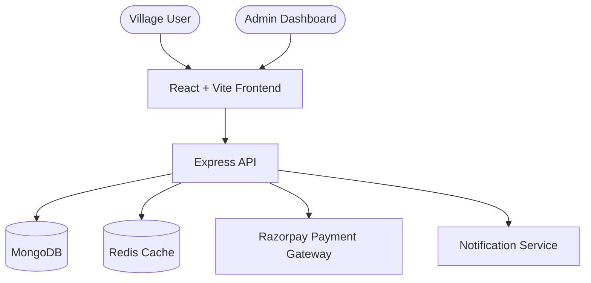
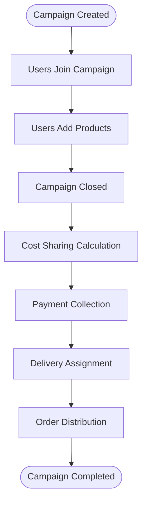
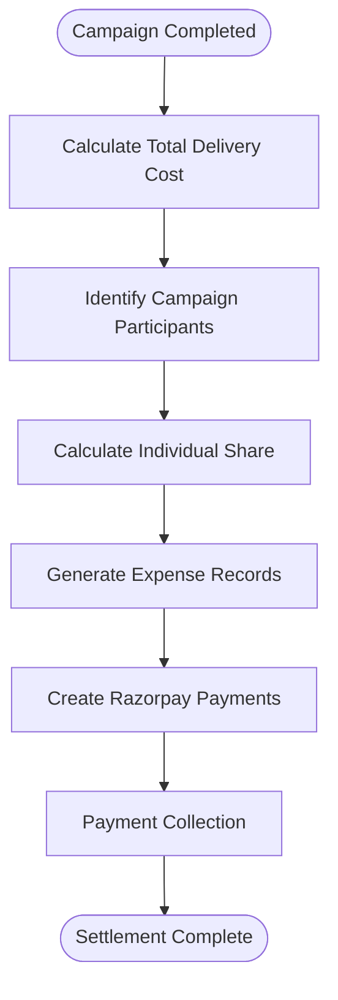
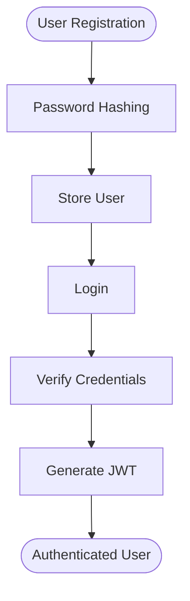

# VillageCart

A production-grade collaborative commerce platform designed for rural communities. VillageCart enables villages to organize group purchases, share delivery costs, coordinate logistics, and manage transparent expense settlements through a centralized digital platform.

The platform reduces transportation costs, increases purchasing power through bulk buying, and simplifies last-mile delivery management for geographically distributed communities.

---

## Problem Statement

Rural communities often face several challenges when purchasing goods:

- High transportation costs for individual orders
- Limited access to suppliers and distributors
- Inefficient last-mile delivery systems
- Lack of transparency in shared expenses
- Difficulty coordinating bulk purchases among residents

These challenges increase costs, delay deliveries, and reduce accessibility to essential products.

---

## Solution

VillageCart introduces a collaborative group-buying model where multiple users participate in community purchasing campaigns.

The platform:

- Aggregates orders from multiple users
- Calculates fair delivery cost distribution
- Processes secure online payments
- Coordinates delivery operations
- Tracks settlements and expenses
- Provides transparency throughout the campaign lifecycle

---

# Key Features

## Campaign Management

- Create and manage group-buying campaigns
- Join active campaigns
- Track campaign progress
- Campaign lifecycle management
- Campaign analytics

## Shopping & Orders

- Add products to campaign carts
- Modify orders before campaign closure
- Order tracking
- Inventory visibility

## Expense Management

- Delivery cost sharing
- Expense tracking
- Settlement calculations
- Cost transparency
- Payment reconciliation

## Payment Processing

- Razorpay Integration
- Secure online payments
- Webhook verification
- Payment history tracking
- Settlement records

## Logistics & Delivery

- Delivery partner assignment
- Delivery tracking
- Village-based delivery coordination
- Status updates
- Delivery completion workflow

## Reviews & Feedback

- Product reviews
- Ratings system
- Campaign feedback
- Seller feedback

## Notifications

- Campaign updates
- Payment confirmations
- Delivery alerts
- Important announcements

## Administration

- User management
- Village management
- Coordinator management
- Campaign monitoring
- Analytics dashboard
- Revenue reporting

---

# System Architecture



---

# Core Business Flow



---

# Cost Sharing Flow



---

# Tech Stack

| Layer | Technology |
|---------|---------|
| Frontend | React 18 |
| Frontend Build Tool | Vite |
| Styling | Tailwind CSS |
| HTTP Client | Axios |
| Backend Runtime | Node.js |
| Backend Framework | Express.js |
| Database | MongoDB |
| ORM | Mongoose |
| Cache | Redis |
| Authentication | JWT |
| Password Security | Bcrypt |
| Payment Gateway | Razorpay |
| Testing | Jest |
| Notifications | Custom Notification Service |
| Reverse Proxy | Nginx |
| Containerization | Docker |
| Orchestration | Docker Compose |

---

# User Roles

## Admin

Responsible for:

- Managing users
- Managing villages
- Managing coordinators
- Monitoring campaigns
- Viewing analytics
- Revenue tracking

---

## Coordinator

Responsible for:

- Creating campaigns
- Managing participants
- Coordinating deliveries
- Monitoring campaign progress

---

## User

Responsible for:

- Joining campaigns
- Purchasing products
- Making payments
- Tracking deliveries
- Submitting reviews

---

## Delivery Partner

Responsible for:

- Delivering campaign orders
- Updating delivery status
- Completing deliveries

---

# Authentication Flow



---

# Database Collections

## Users

Stores:

- Name
- Email
- Password
- Role
- Village Association

---

## Campaigns

Stores:

- Campaign Information
- Campaign Status
- Participants
- Products
- Deadlines

---

## Expenses

Stores:

- Cost Distribution
- Settlement Records
- Payment Status

---

## Deliveries

Stores:

- Delivery Assignment
- Tracking Information
- Delivery Status

---

## Villages

Stores:

- Village Information
- Coordinators
- Delivery Zones

---

## Reviews

Stores:

- Product Reviews
- Ratings
- User Feedback

---

## Notifications

Stores:

- Alerts
- Payment Notifications
- Campaign Updates

---

# API Modules

## Authentication

```text
/api/auth/register
/api/auth/login
/api/auth/me
/api/auth/logout
```

---

## Campaigns

```text
/api/campaigns
/api/campaigns/:id
/api/campaigns/:id/join
/api/campaigns/:id/leave
/api/campaigns/:id/close
```

---

## Expenses

```text
/api/expenses/:campaignId
/api/expenses/:campaignId/calculate
/api/expenses/:campaignId/settlement
```

---

## Delivery

```text
/api/delivery/:campaignId
/api/delivery/:campaignId/status
/api/delivery/track/:campaignId
```

---

## Villages

```text
/api/villages
/api/villages/:id
```

---

## Reviews

```text
/api/reviews
```

---

## Notifications

```text
/api/notifications
```

---

## Admin

```text
/api/admin
```

---

# Security Features

- JWT Authentication
- Password Hashing with Bcrypt
- Protected Routes
- Role-Based Access Control
- Razorpay Signature Verification
- Input Validation
- Environment Variable Protection
- Centralized Error Handling
- Secure API Communication
- CORS Protection

---

# Folder Structure

```text
villagecart-production/
│
├── backend/
│   ├── src/
│   │   ├── db/
│   │   ├── middleware/
│   │   ├── routes/
│   │   ├── services/
│   │   ├── utils/
│   │   └── __tests__/
│   │
│   ├── package.json
│   ├── Dockerfile
│   └── jest.config.js
│
├── frontend/
│   ├── src/
│   │   ├── api/
│   │   ├── components/
│   │   ├── pages/
│   │   └── App.jsx
│   │
│   ├── public/
│   ├── package.json
│   ├── vite.config.js
│   ├── tailwind.config.js
│   └── Dockerfile
│
├── nginx/
│   └── nginx.conf
│
├── docker-compose.yml
├── .env.example
├── README.md
└── .gitignore
```

---

# Environment Variables

Create a `.env` file:

```env
NODE_ENV=production

PORT=4000

MONGO_URL=mongodb://mongo:27017/villagecart

REDIS_URL=redis://redis:6379

JWT_SECRET=your-super-secret-jwt-key

RAZORPAY_KEY_ID=

RAZORPAY_KEY_SECRET=

TWILIO_ACCOUNT_SID=

TWILIO_AUTH_TOKEN=

SENDGRID_API_KEY=

VITE_API_URL=http://localhost:4000/api

VITE_APP_NAME=VillageCart
```

---

# Local Development Setup

## Clone Repository

```bash
git clone https://github.com/yourusername/villagecart-production.git

cd villagecart-production
```

---

## Install Backend Dependencies

```bash
cd backend

npm install
```

---

## Install Frontend Dependencies

```bash
cd ../frontend

npm install
```

---

## Start Development Environment

```bash
docker-compose up --build
```

---

# Application URLs

Frontend:

```text
http://localhost:3000
```

Backend:

```text
http://localhost:4000/api
```

---

# Docker Deployment

Build and start all services:

```bash
docker-compose up --build
```

Run in detached mode:

```bash
docker-compose up -d
```

Stop all services:

```bash
docker-compose down
```

View logs:

```bash
docker-compose logs -f backend

docker-compose logs -f frontend
```

---

# Monitoring & Logging

The platform includes:

- Centralized Error Handling
- API Request Logging
- Payment Event Logging
- Campaign Activity Tracking
- Audit Logs
- Delivery Status Logs

---

# Testing

Run backend tests:

```bash
npm test
```

Run specific test suite:

```bash
npm run test:campaigns

npm run test:expenses

npm run test:payments
```

---

# Future Improvements

- Mobile Application
- AI-powered Demand Forecasting
- Delivery Route Optimization
- Real-time Tracking Dashboard
- Multi-village Campaign Federation
- Offline-first Support
- Warehouse Management System
- Advanced Analytics Platform

---

# Screenshots

## Dashboard


## Campaign Management


## Expense Management


## Delivery Tracking


---

# License

MIT License

Copyright (c) 2026 VillageCart

Permission is hereby granted, free of charge, to any person obtaining a copy of this software and associated documentation files to deal in the Software without restriction.

---

Built with ❤️ for rural communities and collaborative commerce.
